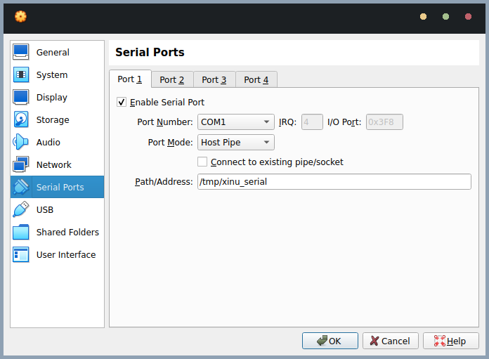
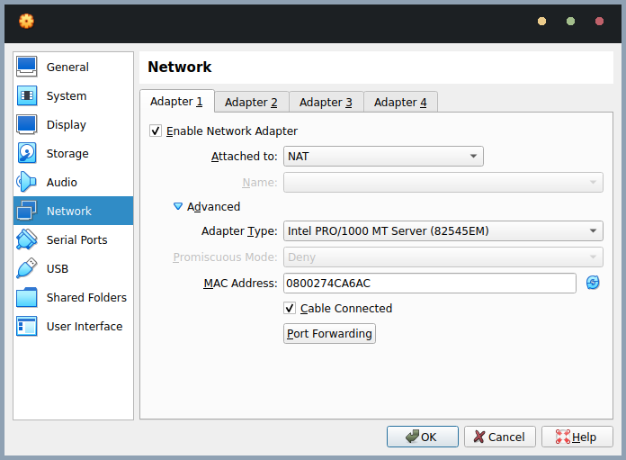

# Xinu-without-Development-System

This is a fork of the Xinu operating system, which is a teaching operating system developed at Purdue University. This fork is intended to be used without the development system, which is a set of tools that are used to build and run Xinu.

Tested on Linux with VirtualBox 7.0.6

## Requirements
- VirtualBox
- minicom
- gcc
- make

## Setup
1. Clone this repository
```
git clone https://github.com/bl33dz/Xinu-without-Development-System.git
```
2. Copy TFTP folder to your VirtualBox configuration directory. (Default Linux: ~/.config/VirtualBox)
```
cp -r TFTP ~/.config/VirtualBox
```
3. Import backend.ova into VirtualBox
4. Uncheck "Connect to existing pipe/socket" in Serial Port settings.

5. Setting Network Adapter to NAT.

6. Start the backend VM.
7. Start minicom and use `unix#/tmp/xinu_serial` as the serial port.
```
sudo minicom -D unix#/tmp/xinu_serial
```
